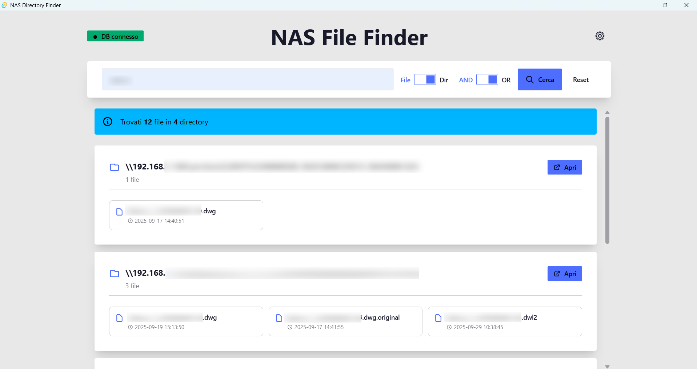

# NAS File Finder

A desktop application for fast file and directory searching within a NAS system.

Born from the need to overcome the limitations of traditional file explorer search functions, which are very slow when interacting with the entire file system of large-scale storage systems.

## The Problem
Classic search through file explorers is inefficient on NAS systems with thousands of files and folders, as it must physically scan the entire file system for each search.

## The Solution
The project involves a **periodic scan** of the NAS content that stores all files and their directories in a central PostgreSQL database through a dedicated backend (to be published later). This frontend application allows you to obtain the searched directories and files **within seconds**, with the ability to easily open the found folder through the system file explorer.

## Screenshots

### Main Interface

*Search interface with connection status and search options*

### Search Results

*Results grouped by directory with file details*

### Settings Panel

*Database connection configuration*

## Features

- **Fast Search**: Search files by name or directory path with AND/OR logic
- **Intuitive Interface**: Modern UI built with Svelte 5 and DaisyUI
- **Database Connection**: Configurable PostgreSQL connection for searching
- **System Integration**: Open found directories directly in File Explorer
- **Organized Visualization**: Results grouped by directory with statistics
- **Cross-Platform**: Supports Windows, macOS, and Linux

## Technologies Used

- **Frontend**: Svelte 5 + SvelteKit + DaisyUI + TailwindCSS
- **Backend**: Tauri 2 + Rust
- **Database**: PostgreSQL (connection via tokio-postgres)
- **Build**: Bun runtime

## Requirements

To run this application, you need to install:

1. **Bun** - JavaScript Runtime: https://bun.sh/docs/installation
2. **Rust** - Programming Language: https://www.rust-lang.org/tools/install
3. **PostgreSQL** - Database with existing file schema
4. **MSVC** (Windows only) - Microsoft Visual Studio Community: https://visualstudio.microsoft.com/vs/community/
   - Make sure to select the "Desktop development with C++" workload

## Setup

```bash
git clone https://github.com/nsilveri/nas-file-finder.git
cd nas-file-finder
bun install
```

## Database Schema

The application expects a PostgreSQL table with the following structure:

```sql
CREATE TABLE files (
    id SERIAL PRIMARY KEY,
    filename VARCHAR NOT NULL,
    directory VARCHAR NOT NULL,
    last_modified TIMESTAMP
);
```

## Configuration

On first startup, configure the database connection via the settings icon:

- **Host**: PostgreSQL server address
- **Port**: Database port (default: 5432)
- **Database**: Database name
- **User**: Username for access
- **Password**: Password for access

## Useful Commands

### Start development server
```bash
bun run tauri dev
```

### Build executable
```bash
bun run tauri build
```

### Other development commands
```bash
# TypeScript/Svelte code check
bun run check

# Code formatting
bun run format

# Linting
bun run lint
```

## How to Use

1. **Configure Database**: Click the settings icon and enter connection details
2. **Test Connection**: The status badge will show if the connection is active
3. **Search Files**: 
   - Enter search terms separated by spaces or commas
   - Choose whether to search in filenames or directory paths
   - Select AND logic (all terms) or OR logic (at least one term)
4. **Explore Results**: Files are grouped by directory, click "Open" to open the folder

## Useful Links

- [Svelte 5 Documentation](https://svelte.dev/docs)
- [Tauri 2 Documentation](https://tauri.app/start/)
- [DaisyUI Components](https://daisyui.com/docs/)
- [PostgreSQL Documentation](https://www.postgresql.org/docs/)

## Notes

- Primarily tested on Windows 11
- Supports all operating systems supported by Tauri
- Search is limited to 100 results for performance

## Acknowledgments

This project is based on the Tauri 2 + Svelte 5 boilerplate created by [Alysonhower Veras Vieira](https://github.com/alysonhower). Heartfelt thanks for providing an excellent starting foundation that made the rapid development of this application possible.

**Original repository**: [tauri2-svelte5-boilerplate](https://github.com/alysonhower/tauri2-svelte5-boilerplate)

## License
This project is licensed under the MIT License - see the [LICENSE](LICENSE) file for details.