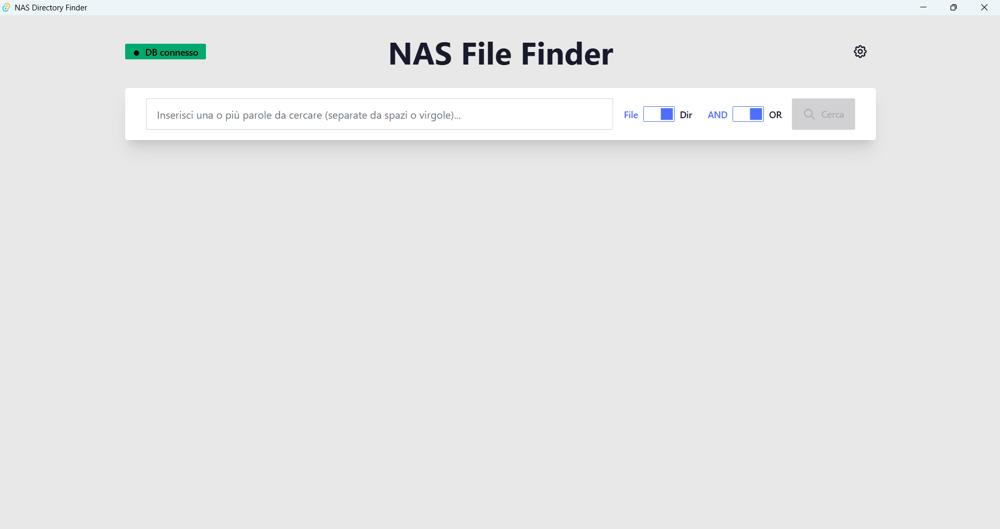

# NAS File Finder

Un'applicazione desktop per la ricerca veloce di file e directory all'interno di un NAS. 

Nasce dalla necessità di superare le limitazioni delle funzioni di ricerca tradizionali dei file explorer, che risultano molto lente quando devono interagire con l'intero file system di sistemi di storage di grandi dimensioni.

## Il Problema
La ricerca classica attraverso i file explorer è inefficiente su NAS con migliaia di file e cartelle, poiché deve scansionare fisicamente tutto il file system ad ogni ricerca.

## La Soluzione
Il progetto prevede una **scansione periodica** del contenuto del NAS che storicizza tutti i file e le relative directory in un database centrale PostgreSQL attraverso un backend dedicato (che verrà pubblicato in seguito). Questa applicazione frontend permette di ottenere **nel giro di pochi secondi** le directory e i file ricercati, con la possibilità di aprire agevolmente la cartella trovata attraverso il file explorer di sistema.

## Screenshots

### Interfaccia Principale

*Interfaccia di ricerca con stato connessione e opzioni di ricerca*

### Risultati di Ricerca  

*Risultati raggruppati per directory con dettagli dei file*

### Pannello Impostazioni

*Configurazione connessione database*

## Caratteristiche

- **Ricerca Veloce**: Cerca file per nome o percorso directory con logica AND/OR
- **Interfaccia Intuitiva**: UI moderna sviluppata con Svelte 5 e DaisyUI
- **Connessione Database**: Connessione configurabile a PostgreSQL per la ricerca
- **Integrazione Sistema**: Apri direttamente le directory trovate in Esplora File
- **Visualizzazione Organizzata**: Risultati raggruppati per directory con statistiche
- **Cross-Platform**: Supporta Windows, macOS e Linux

## Tecnologie Utilizzate

- **Frontend**: Svelte 5 + SvelteKit + DaisyUI + TailwindCSS
- **Backend**: Tauri 2 + Rust
- **Database**: PostgreSQL (connessione via tokio-postgres)
- **Build**: Bun runtime

## Requisiti

Per eseguire questa applicazione, è necessario installare:

1. **Bun** - Runtime JavaScript: https://bun.sh/docs/installation
2. **Rust** - Linguaggio di programmazione: https://www.rust-lang.org/tools/install
3. **PostgreSQL** - Database con schema di file esistente
4. **MSVC** (solo Windows) - Microsoft Visual Studio Community: https://visualstudio.microsoft.com/vs/community/
   - Assicurati di selezionare il workload "Desktop development with C++"

## Setup

```bash
git clone https://github.com/nsilveri/nas-file-finder.git
cd nas-file-finder
bun install
```

## Schema Database

L'applicazione si aspetta una tabella PostgreSQL con la seguente struttura:

```sql
CREATE TABLE files (
    id SERIAL PRIMARY KEY,
    filename VARCHAR NOT NULL,
    directory VARCHAR NOT NULL,
    last_modified TIMESTAMP
);
```

## Configurazione

Al primo avvio, configura la connessione al database tramite l'icona delle impostazioni:

- **Host**: Indirizzo del server PostgreSQL
- **Porta**: Porta del database (default: 5432)
- **Database**: Nome del database
- **Utente**: Username per l'accesso
- **Password**: Password per l'accesso

## Comandi Utili

### Avvia server di sviluppo
```bash
bun run tauri dev
```

### Build dell'eseguibile
```bash
bun run tauri build
```

### Altri comandi di sviluppo
```bash
# Controllo codice TypeScript/Svelte
bun run check

# Formattazione codice
bun run format

# Linting
bun run lint
```

## Come Usare

1. **Configura Database**: Clicca sull'icona impostazioni e inserisci i dettagli di connessione
2. **Testa Connessione**: Il badge di stato mostrerà se la connessione è attiva
3. **Cerca File**: 
   - Inserisci i termini di ricerca separati da spazi o virgole
   - Scegli se cercare nei nomi file o nei percorsi directory
   - Seleziona logica AND (tutti i termini) o OR (almeno un termine)
4. **Esplora Risultati**: I file sono raggruppati per directory, clicca "Apri" per aprire la cartella

## Link Utili

- [Svelte 5 Documentation](https://svelte.dev/docs)
- [Tauri 2 Documentation](https://tauri.app/start/)
- [DaisyUI Components](https://daisyui.com/docs/)
- [PostgreSQL Documentation](https://www.postgresql.org/docs/)

## Note

- Testato principalmente su Windows 11
- Supporta tutti i sistemi operativi supportati da Tauri

## Ringraziamenti

Questo progetto è basato sul boilerplate Tauri 2 + Svelte 5 creato da [Alysonhower Veras Vieira](https://github.com/alysonhower). Un sentito ringraziamento per aver fornito un'eccellente base di partenza che ha reso possibile lo sviluppo rapido di questa applicazione.

**Repository originale**: [tauri2-svelte5-boilerplate](https://github.com/alysonhower/tauri2-svelte5-boilerplate)

## License
This project is licensed under the MIT License - see the [LICENSE](LICENSE) file for details.